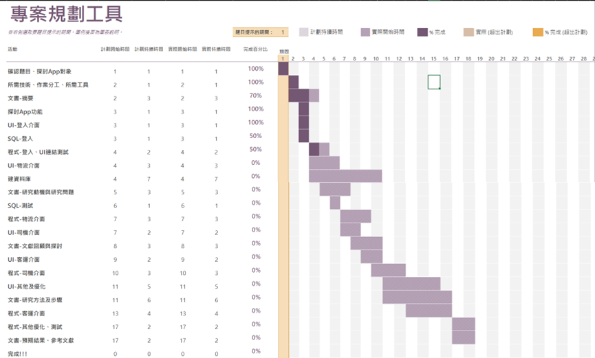
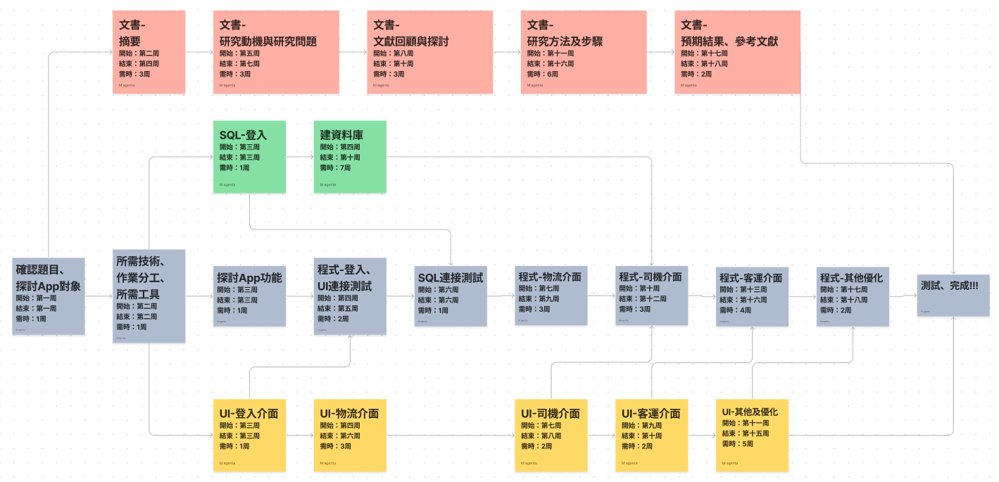
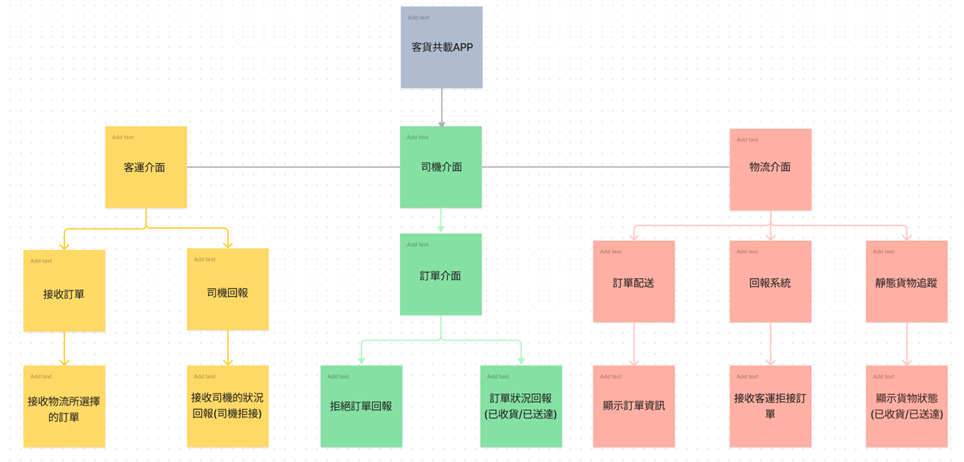
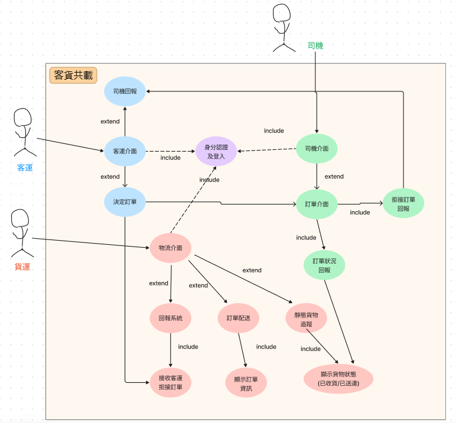
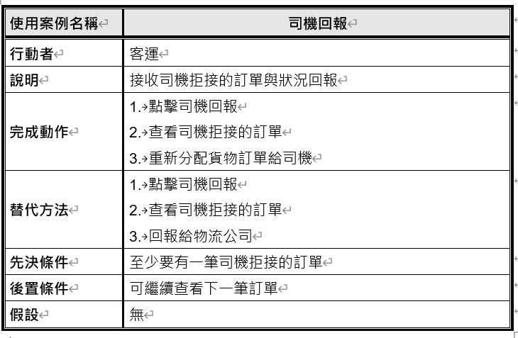
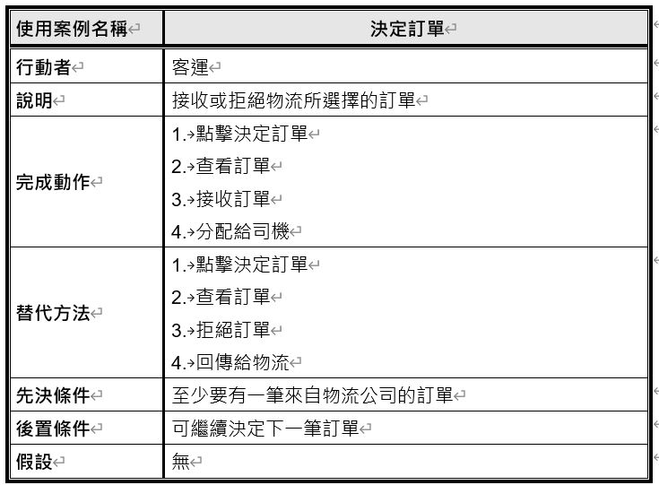
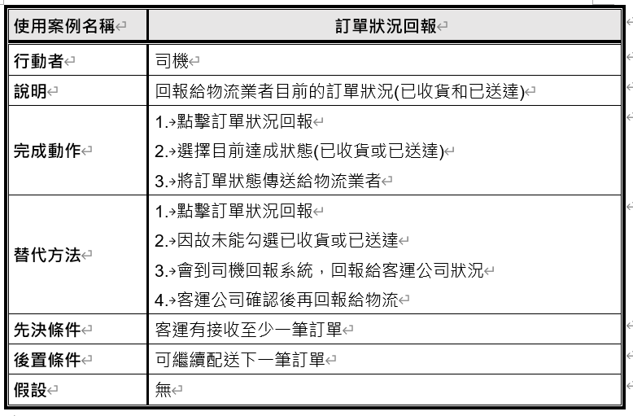
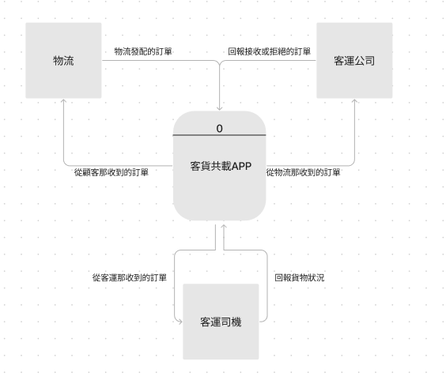
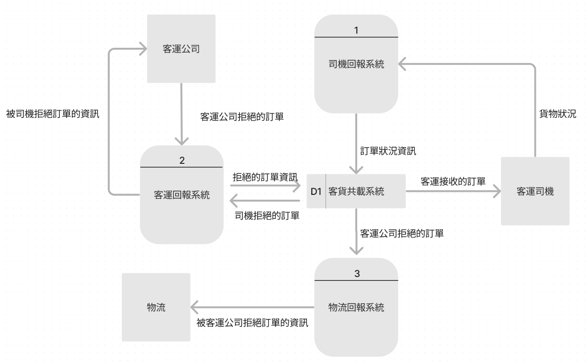
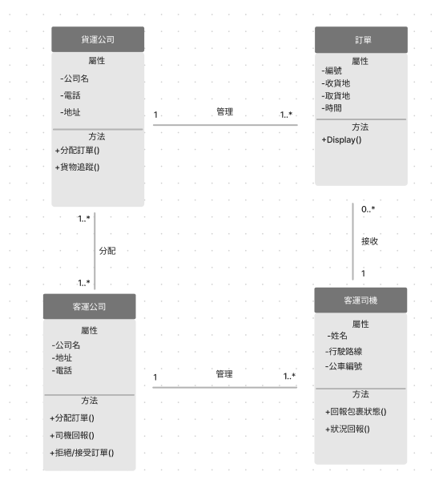

### 專題成員
>### 組長：黃心雨
>### 組員：林聖智、黃瑋豪、陳妤萱
---
Homework1
---
### 任務
>### 文書：陳妤萱
>### 美編：黃瑋豪
>### 程式：黃心雨
>### 資料庫：林聖智
---
### 專題題目：
>客貨共載App
---
### 內容：
>在台灣偏鄉地區的公共客運資源使用率較低，公車常常處於有班次，卻沒有人搭乘的情形。而貨運方面，偏鄉地區的貨運需求較低，偶爾有少量的貨物時，也需要額外靠人力配送。因此政府修法，讓經營偏鄉地區的客運，可以提供幫忙運貨的服務。而目前客運與貨運之間沒有任何關於客貨共載的配套系統，於是我們想做一個App，讓客運以及貨運之間有個連結，而我們是以第三方的方式，透過我們設計的app輔助兩者間的交流，使得客運可以透過接單的方式幫貨運公司把貨送到偏遠的地方，既能降低貨運公司的運輸成本，也能提升公車的使用率。
---
### 甘特圖
>
---
### PERT/CPM圖
>
---
Homework2
---
### 功能性需求及非功能性需求
功能性需求
> 初始介面:身分選擇(物流、客運、司機) 
> 登入介面:身分驗證(物流、客運、司機) 
> 不同身分進行登入後的頁面功能 
>* 物流：
>> 訂單配送：顯示-訂單資訊(編號、時間、取貨地、目的地)選擇需配送的訂單 
>> 回報系統：接收到客運拒絕的訂單，並顯示其資訊 
>> 靜態貨物追蹤：顯示貨物狀況(已收貨/已送達) 
>* 客運：
>> 接收訂單：接受物流所選擇的訂單 
>> 司機回報：接收司機的狀況回報 
>* 司機：
>> 訂單介面：顯示訂單資訊 
>> 狀況回報 

非功能性需求
> 維護性(maintainability)：
>> 1.按照功能與介面進行命名 
>>> EX：圖案是公車，所以取名是id=bus、登入就是以功能性命名id=login

>> 2.按照JAVA進行編碼原則 

> 使用性(usability)：
>> 接觸10分鐘內上手

> 反應時間(response time)：
>> 切換功能與頁面0.5秒內
---
### 功能分解圖(functional decomposition diagram)
>
---
### 客運共載系統的需求分析
1. 使用者先進行身分後登入帳密
2. 貨運人員可以選擇要發配的訂單
3. 客運人員接收貨運公司發配的訂單決定接單與否
4. 司機接收客運人員發配的訂單
5. 假如公車有狀況，司機必須回報給客運
6. 假如客運公司拒單，物流會接收到訊息
---
### 客運共載系統的需求分析
* 使用案例圖：
>
* 使用案例說明：
>
>
>
---
### Figma劃出第一個使用案例的動態模擬畫面
<https://www.figma.com/proto/q5NwxJRBsfLTIXxtkkRD9f/%E5%AE%A2%E8%B2%A8%E5%85%B1%E8%BC%89app-%E7%99%BB%E5%85%A5%E4%BB%8B%E9%9D%A2?node-id=103%3A25&scaling=scale-down&page-id=0%3A1&starting-point-node-id=103%3A25&show-proto-sidebar=1>
---
Homework3
---
### DFD
>
---
### DFD Level 0
>
---
Homework4
---
### Class Diagram
>
